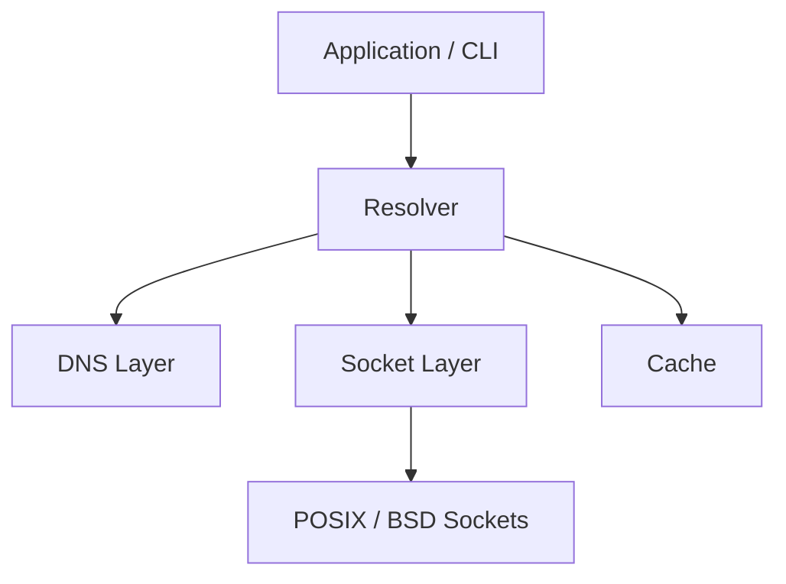

# DNS Resolver

A DNS stub resolver written in modern C++ 26.

The project is built from the bottom up to explore DNS, binary network protocols, socket programming, resource ownership, and defensive parsing. Rather than relying on an existing networking or DNS framework, the resolver implements the core networking and protocol layers directly.

This is a **stub resolver**: it sends queries to an upstream recursive resolver rather than performing full recursive resolution itself. Authoritative DNS serving, DNSSEC, DoT, DoH, and asynchronous networking are outside the initial scope.

## Status

**Socket layer — in progress.**

No DNS queries are sent or parsed yet. The repository currently contains the UDP socket abstraction and a small interactive echo server used to exercise it. The DNS, resolver, and cache layers described below are planned, not implemented.

## Goals

The primary goal of this project is to build a functional DNS resolver while developing a deeper understanding of the systems underneath DNS.

Key areas of focus include:

* BSD/POSIX socket programming
* RAII and resource ownership
* IPv4 and IPv6 addressing
* Binary serialization and parsing
* DNS message encoding and decoding
* DNS name compression
* Testing network and protocol code
* DNS caching and TTL behavior

## Architecture

The project is organized into small components with the goal of keeping protocol logic independent from the operating system's networking details.



### Socket Layer

The socket layer isolates the resolver from the POSIX/BSD sockets API and provides the networking primitives used by higher-level components.

It currently supports IPv4 and IPv6 addressing along with UDP datagram communication, while managing native socket resources through RAII. Platform-specific details such as file descriptors, data structures, byte-order conversions, and direct socket system calls are kept within this subsystem.

This allows the DNS and resolver layers to work with higher-level C++ types without depending directly on the operating system's networking representation.

See the [Socket Layer documentation](include/socket/README.md) for details on its architecture, ownership model, address representation, error handling, and API usage.

### DNS Layer

*Planned.* The DNS layer handles DNS-specific protocol behavior on byte-oriented data without interacting with native socket APIs. It has two halves.

**Encoding** builds a query directly from its wire representation:

* header fields and flags
* domain names encoded as length-prefixed labels
* question encoding
* explicit network byte-order handling

**Parsing** reads a response back out of a buffer received from an upstream resolver:

* the four message sections
* resource records
* compressed domain names, including pointer loops
* bounds-checked reads
* defined behavior on malformed packets

### Resolver

*Planned.* The resolver combines the DNS and networking layers into a usable stub resolver:

* sending queries to a configured upstream recursive resolver
* matching responses to outstanding queries by transaction ID and question
* timeouts and retries
* TCP fallback when a response comes back truncated, including two-byte length framing

### Cache

*Planned.* A TTL-aware LRU cache sits in front of the resolver so repeated lookups do not go out to the network. Entries expire according to the TTL of the records they hold, and eviction is least recently used once the cache is full.

## Project Structure

```text
DnsResolver/
├── CMakeLists.txt
├── README.md
├── include/
│   └── socket/
│       ├── DatagramSocket.h
│       ├── FileDescriptor.h
│       ├── IpAddress.h
│       └── SocketAddress.h
├── src/
│   └── socket/
└── main.cpp
```

The structure will expand as the DNS and resolver components are implemented.

## Building

### Requirements

* **POSIX host.** The socket layer uses BSD sockets directly; Windows is not supported.
* **A C++26 toolchain.** Developed and tested with Homebrew Clang and libc++ on arm64 macOS. Other compilers with sufficient C++26 support (including `<print>`) should work but are untested.
* **CMake 3.30 or newer**
* **Git**

Catch2 is retrieved automatically through CMake's `FetchContent`.

### Configure

```sh
cmake -S . -B build
```

### Build

```sh
cmake --build build
```

### Run

The current executable is a development program used to exercise the socket layer, not a DNS client.

It binds a UDP socket to `127.0.0.1:9000`, prints each datagram it receives, and then blocks on standard input so a reply can be typed back to the sender. It runs until interrupted.

```sh
./build/DnsResolver
```

In a second terminal:

```sh
nc -u 127.0.0.1 9000
```

Anything typed into `nc` is printed by the server; anything typed at the server's `Server>` prompt is sent back to `nc`.

## Testing

Catch2 is wired into the build via `FetchContent`.

Later testing work includes fuzzing the response parser and differential testing against existing DNS tools.

## Documentation

Documentation is maintained at three levels:

* **Project documentation** — this README describes the overall project, architecture, status, and roadmap.
* **Component documentation** — component READMEs describe the responsibilities and design of subsystems such as the socket and DNS layers.
* **API documentation** — public C++ interfaces document important contracts, ownership semantics, errors, parameters, and behavior relevant to callers.

Implementation comments are reserved for behavior that is not reasonably explained by the code itself.

## Learning Resources

The project is being developed alongside primary networking and protocol references, including:

* *Computer Networking: A Top-Down Approach* — Kurose & Ross
* *TCP/IP Illustrated, Volume 1* — Stevens & Fall
* [Beej's Guide to Network Programming](https://beej.us/guide/bgnet/)
* [RFC 1034 — Domain Names: Concepts and Facilities](https://www.rfc-editor.org/rfc/rfc1034)
* [RFC 1035 — Domain Names: Implementation and Specification](https://www.rfc-editor.org/rfc/rfc1035)
* [cppreference](https://en.cppreference.com/)
* [C++ Weekly](https://www.youtube.com/@cppweekly)
