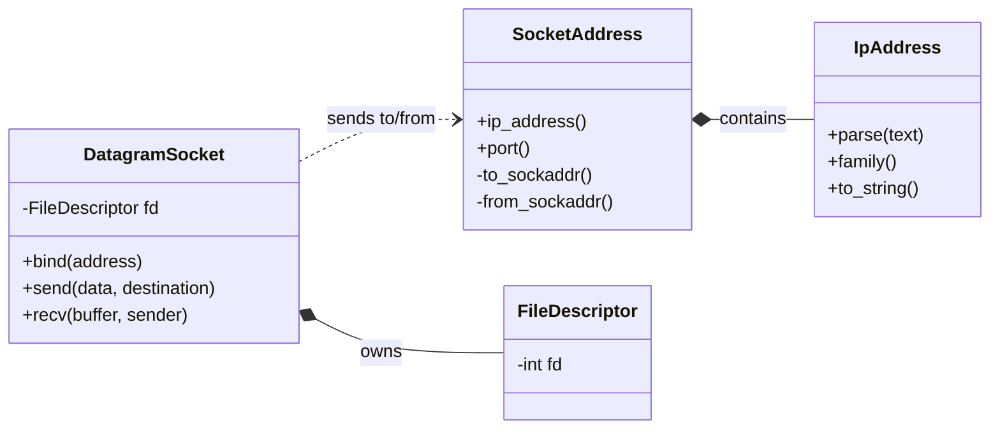

# Socket Layer

The socket layer provides the low-level networking foundation for `DnsResolver`. Its purpose is to isolate the rest of the project from the details of the POSIX/BSD sockets API and expose a smaller set of C++ types for working with network addresses and UDP sockets.

Rather than allowing higher-level code to manipulate raw file descriptors, data structures, byte-order conversions, and socket system calls directly, those responsibilities are kept within this subsystem. The DNS and resolver layers can therefore operate on addresses, byte buffers, and socket objects without worrying about the operating system's networking representation.

## Design at a Glance


The layer is divided into small types with distinct responsibilities. `IpAddress` and `SocketAddress` represent networking values, `FileDescriptor` manages ownership of the native operating-system resource, and `DatagramSocket` combines these pieces to provide UDP operations.

## Public Types

| Type             | Responsibility                                                                                                                              |
| ---------------- | ------------------------------------------------------------------------------------------------------------------------------------------- |
| `FileDescriptor` | Owns the lifetime of a native file descriptor and closes it when ownership ends.                                                            |
| `IpAddress`      | Represents either an IPv4 or IPv6 address and handles conversion between textual and native address representations.                        |
| `SocketAddress`  | Combines an `IpAddress` with a port and owns conversion to and from POSIX socket-address structures.                                        |
| `DatagramSocket` | Owns a UDP socket and provides the socket operations currently needed by the resolver, including binding, sending, and receiving datagrams. |

## Ownership and Lifetime

The socket layer uses RAII to tie the lifetime of an operating-system file descriptor to a C++ object.

```text
DatagramSocket
      owns
        |
        v
FileDescriptor
      owns
        |
        v
native file descriptor
```

`FileDescriptor` is the resource-owning type in the subsystem. Copying it is prohibited because two independent objects must not both believe they own the same descriptor. Instead, ownership can be moved from one `FileDescriptor` to another. A move transfers the descriptor and leaves the source object in a non-owning state.

When the owning `FileDescriptor` is destroyed, it closes the descriptor if one is still held. This prevents callers from having to manually pair socket creation with `close()` and avoids leaking the resource when control leaves a scope.

`DatagramSocket` contains a `FileDescriptor`, so it receives these ownership semantics through composition. It does not need to independently implement the lifetime rules for the underlying native socket.

## Address Representation

The address model used by this socket layer is partly inspired by Java’s networking API, particularly the separation between InetAddress, InetSocketAddress, and DatagramSocket. This project adopts a similar division of responsibilities while adapting it to modern C++ through RAII, explicit ownership, move semantics, and direct POSIX interoperability.

`IpAddress` represents either an IPv4 `in_addr` or IPv6 `in6_addr` while hiding that distinction from most callers. Textual addresses are parsed into this native representation, and addresses can later be converted back to their presentation form when needed.

A network endpoint requires both an IP address and a port, which is represented by `SocketAddress`.

`SocketAddress` also forms the boundary between the project's address types and the POSIX socket API. POSIX socket calls operate on the `sockaddr` family of structures, while the rest of the project works with `SocketAddress`. Conversion to and from `sockaddr_storage` is therefore kept inside this type and is used internally by `DatagramSocket`.

This prevents higher-level components from needing to understand the different layouts of `sockaddr_in` and `sockaddr_in6` or perform the required casts themselves.

### Byte Order

Ports stored by `SocketAddress` are represented in host byte order.

When an address is converted into a native socket structure, the port is converted to network byte order before being passed to POSIX. When an address received from the operating system is converted back into a `SocketAddress`, the port is converted back to host byte order.

Keeping this conversion at the representation boundary means callers can work with ordinary integer port values without repeatedly handling `htons()` and `ntohs()` themselves.

## Datagram Sockets

`DatagramSocket` is the current socket interface exposed by the layer. It represents an IPv4 or IPv6 UDP socket and owns its native descriptor through `FileDescriptor`.

Its interface provides the three basic operations currently needed by the resolver and other common networking libraries:

- bind() associates the socket with a local SocketAddress.
- send() transmits a sequence of bytes to a destination SocketAddress.
- recv() receives a datagram into a caller-provided buffer and returns the sender’s SocketAddress.

Each operation deals with a single UDP datagram. Unlike a stream socket, DatagramSocket does not establish a connection or expose the data as a continuous byte stream.

Send and receive buffers are represented with std::span. A span is a non-owning view of contiguous memory, so DatagramSocket can work with storage supplied by the caller without taking ownership of it or making an unnecessary copy.

When receiving a datagram, the returned byte count indicates how much of the buffer contains valid data. If recv() returns n, only the range [0, n) contains bytes from the received datagram. The rest of the buffer should be ignored. The operating system also provides the sender’s native socket address, which the socket layer converts into a SocketAddress before returning it to the caller.

With the current exception-based API, a successful return from recv() means that both the payload and sender address were received successfully. Errors from the underlying socket operations are reported through the layer’s error model rather than being encoded in the returned byte count.

Although these operations ultimately map to bind(), sendto(), and recvfrom(), callers do not interact with those system calls directly. Native descriptors, sockaddr structures, address conversions, and other platform-specific details remain contained within the socket layer.
## Usage

### Sending a datagram

```cpp
auto ip = IpAddress::parse("127.0.0.1");
if (!ip) {
    return 1;
}

SocketAddress destination{*ip, 9000};
DatagramSocket socket{AF_INET};

const std::array message{
    std::byte{'h'}, std::byte{'e'}, std::byte{'l'},
    std::byte{'l'}, std::byte{'o'}
};

socket.send(message, destination);
```

### Receiving and replying

```cpp
auto ip = IpAddress::parse("127.0.0.1");
if (!ip) {
    return 1;
}

SocketAddress local{*ip, 9000};
DatagramSocket server{AF_INET};
server.bind(local);

std::array<std::byte, 1024> buffer{};
std::optional<SocketAddress> sender;

const auto bytes_received = server.recv(buffer, sender);
const auto received = std::span<const std::byte>{
    buffer.data(),
    static_cast<std::size_t>(bytes_received)
};

server.send(received, *sender);
```

The important property of these examples is what they do not contain: raw file descriptors, `sockaddr` structures, `sendto()`, `recvfrom()`, casts between address structures, or explicit byte-order conversions. Those details terminate at the socket layer
## Error Model

The socket layer is also the boundary at which failures from the operating system become visible to C++ callers.

Socket creation, binding, sending, and receiving can all fail for reasons reported by the underlying system. These failures are not silently ignored. The current implementation reports failures from socket operations using `std::system_error`, preserving the operating-system error information associated with the failed call.

Invalid socket families supplied when constructing a `DatagramSocket` are rejected separately as invalid arguments.

Address parsing follows a different model: `IpAddress::parse()` returns an empty result when a string cannot be interpreted as either an IPv4 or IPv6 address.

The exact error model may evolve as the resolver grows, but the important boundary remains the same: failures originating in the native networking API must remain observable to code above the socket layer.

## Boundaries and Non-Goals

This subsystem exists primarily to support `DnsResolver`; it is not intended to become a general-purpose networking framework.

The current implementation is deliberately limited:

* UDP datagram sockets are implemented; TCP sockets are not currently part of the layer.
* Only IPv4 and IPv6 address families are supported.
* The implementation directly targets POSIX/BSD sockets and does not currently provide a Windows backend.
* Asynchronous I/O and coroutine integration are outside the current scope.
* DNS message encoding, parsing, transaction handling, caching, and other protocol behavior belong above this layer.

Keeping this boundary narrow allows the socket layer to provide the operating-system functionality required by the resolver without accumulating unrelated networking abstractions.
